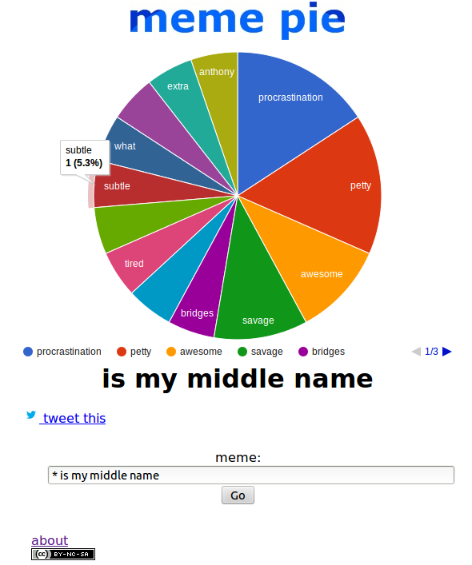

memepie
=======

Make pie charts out of memes. http://memepie.herokuapp.com/

<kbd></kbd>

Travis CI status: 

"Really, this thing is an exercise in despairing for humanity" - Tree

presentation.pdf - an overview with screenshots from the first version.

notes.txt - notes on local development/testing.

You'll need to generate your own API keys (https://apps.twitter.com/) and add them either as Heroku environment variables or directly into secrets.py.

